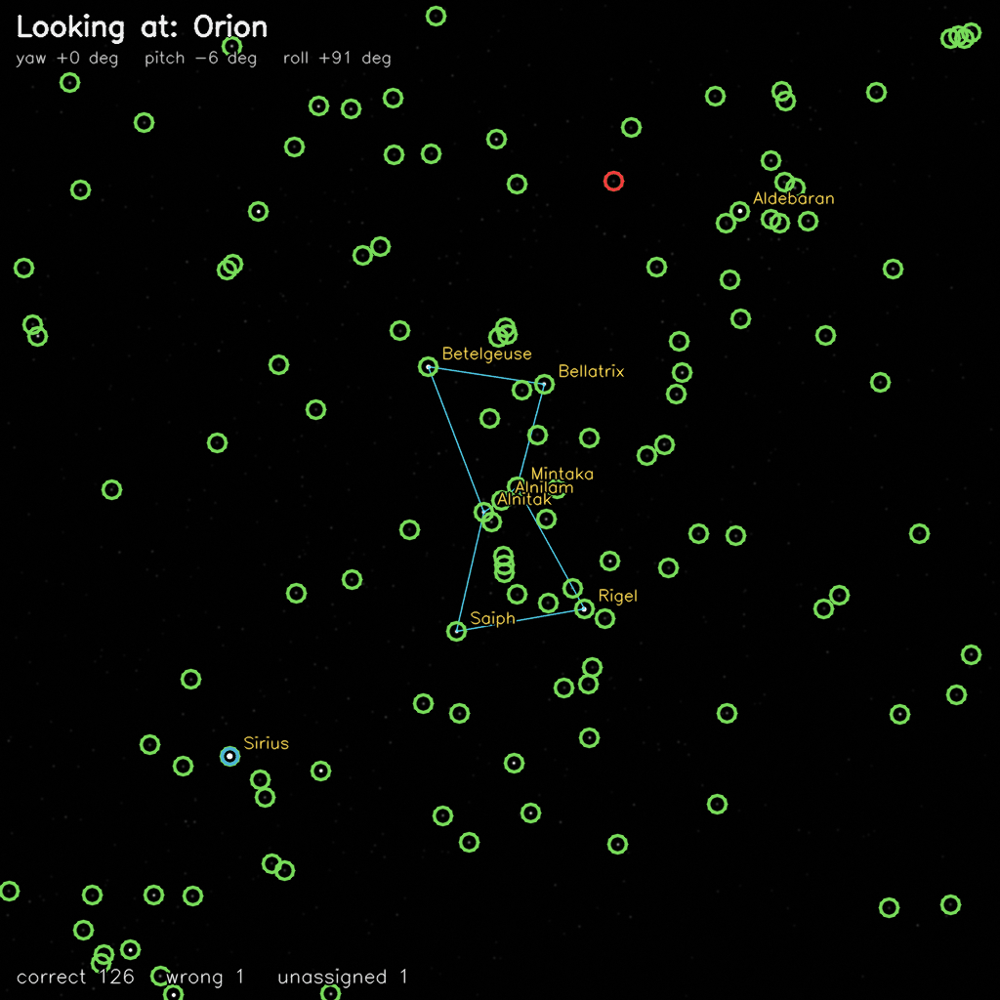
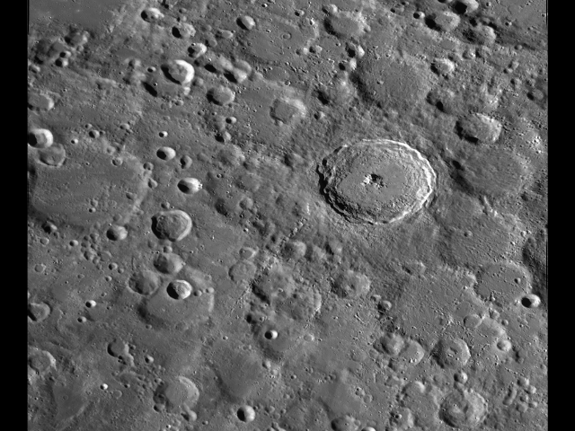
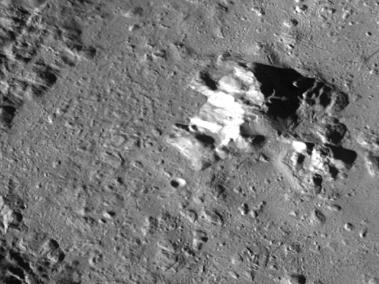
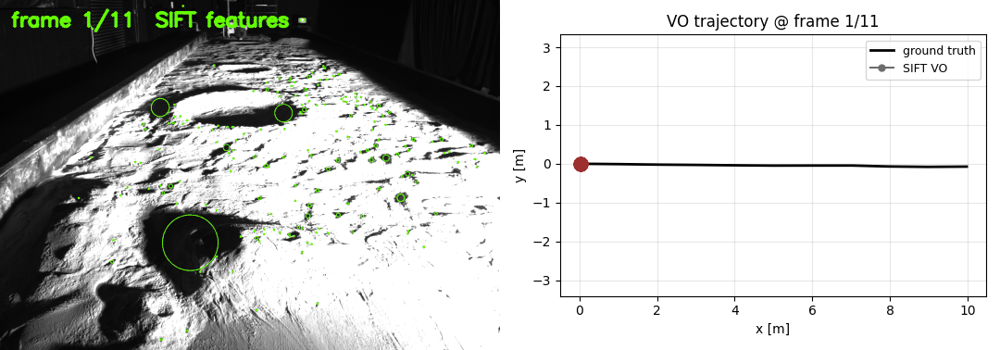
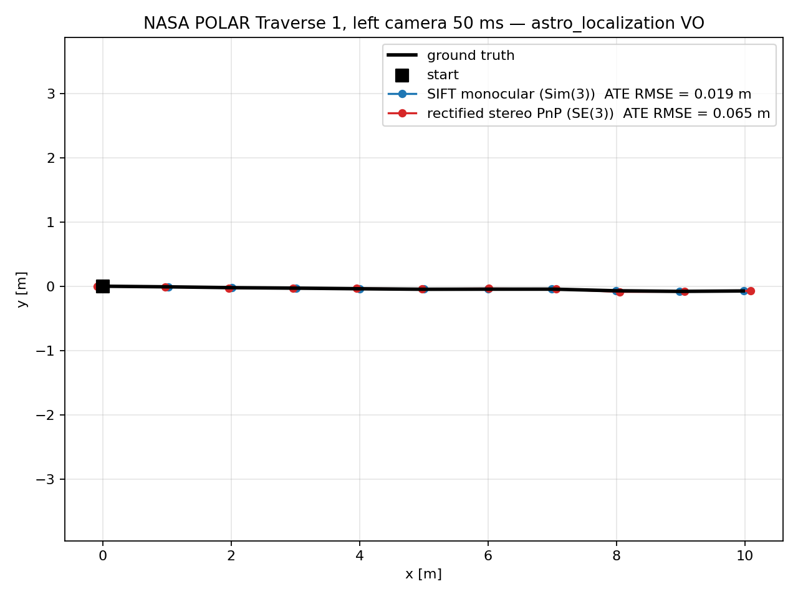

# astro_localization

`astro_localization` is an early-stage C++20 OSS for localization and navigation in GNSS-denied space
robotics: lunar/Mars rovers, orbital robots, planetary explorers, and terrain-relative navigation.

The focus is space-specific localization. First-class directions are **star tracker attitude**,
**lost-in-space star identification** against public catalogs, **lunar visual odometry**, and
**terrain-relative navigation** — not generic Earth robotics VO. The implementation is deliberately
small so that experiments converge quickly, and the Python prototypes live alongside the C++ apps.

## Demo

### Lost-in-space star identification

A satellite that just powered on doesn't know where it's looking. *Lost-in-space* star
identification recovers attitude from a single star tracker image with **no prior** — match
detected centroids against a public catalog by their pairwise angles, then solve Wahba/Kabsch
for the camera-inertial rotation.



Six attitudes whose boresights land on recognisable asterisms are run through the full
pipeline — synthetic exposure → centroid detection → pair-angle index lookup → Wahba
rotation — producing **759 / 768 correct, 7 wrong, 2 unassigned** at 128 centroids per
frame against an 8 920-star HYG mag≤6.5 index. The constellation stick-figures (cyan)
and bright-star labels (gold) are drawn purely from the catalog ids the C++ identifier
emits — they only appear once the matcher recovers attitude. Green rings = correct,
red = wrong, blue = unassigned.

Reproduce the GIF (uses the C++ identifier and a `.bin` index emitted by
`scripts/build_star_pair_index.py --write-bin` or `apps/build_star_pair_index`):

```bash
python3 scripts/render_constellation_demo_gif.py \
  --catalog datasets/star_catalogs/hyg-v42/converted/hyg_v42_bright_mag6p5_unit.csv \
  --index-bin <path-to>/hyg_pair_index_full.bin \
  --output docs/figures/lost_in_space_demo.gif
```

The unannotated random-attitude variant (no constellation overlays, no asterism
preselection) is still available via `scripts/render_lost_in_space_gif.py` for bench
runs.

<details>
<summary>Run a single attitude through the underlying three-step pipeline</summary>

```bash
python3 scripts/render_star_image.py \
  --catalog datasets/star_catalogs/hyg-v42/converted/hyg_v42_mag8p0_unit.csv \
  --output-image outputs/exposure.png \
  --output-truth outputs/truth.csv \
  --yaw-deg 30 --pitch-deg 20 --roll-deg 10

python3 scripts/centroid_stars_from_image.py \
  --input-image outputs/exposure.png \
  --output-observations outputs/observations_unlabeled.csv

python3 scripts/identify_stars_with_pair_index.py \
  --observations outputs/observations_unlabeled.csv \
  --index <path-to>/hyg_pair_index_16000.npz \
  --output outputs/assignments.csv \
  --fx 1000 --fy 1000 --cx 512 --cy 512 \
  --pyramid-size 6 --neighbor-bins 1 --tolerance-arcsec 120 \
  --pyramid-restarts 3 --confidence-fraction 0.5
```

</details>

### Terrain-relative navigation on real LRO + LOLA data

A virtual descent camera at orbital altitude looks down on the lunar surface;
the matcher recovers its position from a single frame against a public LRO
mosaic + LOLA elevation model — no inertial prior, no rover trajectory.



The pipeline fetches LROC WAC tiles via NASA Trek WMTS (~600 KB per scene at
zoom 5) and a LOLA `LDEM_<ppd>.img` from PDS Geosciences (~2 MB at 4 ppd),
forward-renders the rover view by ray-marching every pixel through the real
heightmap, and recovers the camera pose with `cv2.solvePnPRansac(SOLVEPNP_AP3P)`
on (3D world, 2D rover) correspondences.

6-target sweep at 400 km altitude / WAC z=5 (~660 m/px ortho, ~500 km mosaic):

| Target | Matches | Inliers | Position error |
| --- | ---: | ---: | ---: |
| Apollo 11 (Mare Tranquillitatis) | 79 | 24 | 1383 m |
| Apollo 12 (Oceanus Procellarum) | 37 | 16 | 300 m |
| Apollo 15 (Hadley Rille) | 107 | 20 | 574 m |
| Apollo 17 (Taurus-Littrow) | 89 | 16 | 622 m |
| **Tycho (bright ejecta)** | **113** | **24** | **179 m** |
| Copernicus (ray crater) | 58 | 17 | 391 m |

All six recover position with no false positives. Mare targets have ~10x worse
error than crater rim targets because mare SIFT features are dim and self-similar.

Reproduce (downloads ~600 KB ortho + 2 MB DEM on first run, then ~5 s per scene):

```bash
python3 scripts/lro_trn_demo.py --target tycho \
  --output-dir docs/figures/trn_lro_tycho
```

**Terminal descent (30-100 km altitude, finer LRO data):**



Stepping the ortho up to WAC z=8 (~82 m/px, 9 tiles ≈ 350 KB) and the
heightmap up to `LDEM_64` (~470 m/px, ~530 MB one-time download) brings the
rover camera within terminal-descent range. Best per-target altitude on the
6-target sweep:

| Target | Altitude | Matches | Inliers | Position error |
| --- | ---: | ---: | ---: | ---: |
| **Tycho** | 30 km | 82 | 11 | **32 m** |
| Copernicus | 50 km | 78 | 12 | 29 m |
| Apollo 17 (Taurus-Littrow) | 30 km | 68 | 6 | 43 m |
| Apollo 12 (Procellarum) | 100 km | 14 | 8 | 93 m |
| Apollo 15 (Hadley Rille) | 50 km | 92 | — | 130 m |
| Apollo 11 (Tranquillitatis) | 100 km | 35 | 18 | 172 m |

Median ~80 m on a ~92 km × 92 km mosaic — about an order of magnitude tighter
than the orbital cycle 3 numbers. Below ~30 km altitude, parallax distortion
from the real heightmap (Tycho rim at +1.8 km vs camera at 30 km altitude →
~6% image-position shift) starts breaking SIFT scale-space matching; that
cliff is the next-cycle target (ASIFT or render-time orthorectification).

```bash
python3 scripts/lro_trn_demo.py --target tycho \
  --zoom 8 --tile-radius 2 --ldem-ppd 64 \
  --rover-altitude-m 30000 \
  --output-dir docs/figures/trn_lro_tycho_terminal
```

### Lunar visual odometry on NASA POLAR Traverse 1

NASA POLAR Traverse 1 (lunar-analogue testbed), left camera 50 ms exposure, 11 frames. Animated:
SIFT keypoints per frame on the left, the SIFT-monocular VO trajectory accumulating on the right
(Sim(3) aligned to ground truth, ATE RMSE 0.019 m).



Static comparison plot — SIFT monocular and rectified-stereo PnP overlaid on ground truth:



Reproduce locally:

```bash
build/apps/lunar_visual_odometry \
  --images outputs/polar_view1_traverse1_left_50ms/images.txt \
  --fx 1452.71 --fy 1452.88 --cx 999.53 --cy 1035.4 \
  --feature sift \
  --trajectory outputs/trajectory_sift.tum

python3 scripts/plot_trajectory_comparison.py \
  --ground-truth outputs/polar_view1_traverse1_left_50ms/refined_poses.tsv \
  --trajectory "SIFT monocular (Sim(3))" outputs/trajectory_sift.tum sim3 \
  --output outputs/trajectory_sift_demo.png
```

## Headline Results

Numbers below are the current best on the corresponding benchmark. Full per-iteration history is in
[`docs/experiments.md`](docs/experiments.md).

| Module | Benchmark | Result |
| --- | --- | --- |
| Star tracker attitude | 30 stars synthetic, 0.1 px noise | mean attitude error **0.00459 deg** |
| Lost-in-space, idealized (HYG mag≤8, 40k indexed stars — mag≤8 catalog density ceiling) | 32 true + up to 12 false detections, 0.1 px noise, `--pyramid-size 6 --neighbor-bins 1 --tolerance-arcsec 120 --skip-pkl` | **64/64 correct, 0 wrong**, query 61-94 s, build 277 s, .npz 1016 MB, 332 M pairs |
| Lost-in-space, deeper-catalog scout (HYG mag≤9, 60k indexed stars, false=0 smoke) | 1 trial, ps=6, default tight params | **32/32 correct, 0 wrong**, query 294 s (~5 min), build 654 s, .npz 2196 MB, 748 M pairs. Correctness extends past mag≤8; sky-cell partitioning is the prerequisite for routine operation at this density |
| Lost-in-space, high-false-rate idealized (HYG mag≤8, 16k indexed stars) | 32 true + 16/24/32 false detections (33-50% false rate), ps=6 | **64/64 correct, 0 wrong** at every level, query ~6 s |
| Lost-in-space, realistic camera effects + pyramid restart (HYG mag≤8, 16k, ps=6, trials=24, restarts=3) | mag-weighted detection (limiting 7.0) + 50% near-real-star false detections, full sweep false 0/4/8/12 | **768/768 correct, 0 wrong** across 96 trials. Residual catastrophic-failure rate **`<3.1%` at 95% CI** (Rule of three; vs `<17%` no-restart baseline). 86/96 trials succeeded on attempt 0 |
| Lost-in-space, + magnitude-dependent centroid noise (HYG mag≤8, 16k, ps=6, trials=6, restarts=3) | All three realism axes stacked: mag-weighted detection, near-real false, σ_centroid = noise_px·10^(0.4·(mag−6)) | **192/192 correct, 0 wrong**. cand_gen 1.7× of constant-noise baseline at false=12 (faint-star noise widens effective tolerance) |
| Lost-in-space, + 500-year stale catalog (HYG mag≤8, 16k, ps=6, trials=6, restarts=3) | All four realism axes plus `--apply-proper-motion-years 500` drifting RA/Dec by 500·pmra/pmdec mas before projection (matcher still uses J2000 index) | **766/768 correct (99.7%), 0 wrong**. Graceful degradation: high-pm stars (Groombridge 1830 at 7 arcsec/yr → 1400 arcsec drift) drop out of verification, but the recovered attitude is correct in every trial |
| Lost-in-space, **5-axis** realism stack (HYG mag≤8, 16k, ps=6, trials=6, restarts=3) | Above 4 axes (with pm=200) plus `--hot-pixel-fraction 0.5` placing 50% of false detections at fixed sensor hot-pixel positions | **767/768 correct (99.87%), 0 wrong**. 2/24 trials hit the 4-attempt restart-budget ceiling but still recovered. Five realism axes stacked still preserve correctness via restart |
| Lunar VO (POLAR Traverse1, L 50 ms, monocular SIFT) | 11 frames, Sim(3) alignment | ATE RMSE **0.0186 m**, 11/11 frames OK |
| Lunar VO (POLAR Traverse1, L 50 ms, rectified stereo + PnP) | 11 frames, SE(3) | ATE RMSE **0.0650 m**, path 10.18 m vs 9.98 m GT |
| Lunar VO (POLAR Traverse**1-6**, L 50 ms, rectified stereo + PnP, **SIFT** + CLAHE + `--ratio-test 0.85`) | 66 frames total | **65/66 frames OK** (ORB+default-ratio baseline was 15/33 on T4-T6). T1 11/11 ATE 0.028 m, T2 11/11 ATE 0.037 m, T3 11/11 ATE 0.043 m, T4 11/11 ATE 0.069 m, T5 11/11 ATE 0.080 m, T6 10/11 ATE 0.413 m |

`--pyramid-size 6 --neighbor-bins 1 --tolerance-arcsec 120` is the operational default for honest-density
HYG mag≤8 lost-in-space work.

## Build

Dependencies: CMake 3.20+, C++20 compiler, OpenCV 4 (`features2d`, `calib3d`, `imgcodecs`, `imgproc`),
Eigen3.

```bash
cd astro_localization
cmake -S . -B build -DCMAKE_BUILD_TYPE=Release
cmake --build build --parallel
```

## Quick Start

Run lunar visual odometry on a POLAR Traverse left-camera 50 ms sequence:

```bash
python3 scripts/download_dataset.py --dataset polar-traverse-view1 --output datasets --confirm-large
python3 scripts/prepare_polar_traverse.py \
  --root datasets/polar-traverse-view1/extracted --camera L --exposure-ms 50 \
  --output outputs/polar_view1_left_50ms

build/apps/lunar_visual_odometry \
  --images outputs/polar_view1_left_50ms/images.txt \
  --fx 1452.71 --fy 1452.88 --cx 999.53 --cy 1035.4 \
  --feature sift --clahe \
  --trajectory outputs/trajectory_sift.tum
```

Run lost-in-space star identification against a public HYG catalog subset:

```bash
python3 scripts/download_star_catalog.py --catalog hyg-v42 --output datasets/star_catalogs
python3 scripts/convert_star_catalog.py \
  --input datasets/star_catalogs/hyg-v42/raw/hyg_v42.csv.gz \
  --output datasets/star_catalogs/hyg-v42/converted/hyg_v42_mag8p0_unit.csv \
  --format hyg --max-magnitude 8.0

python3 scripts/build_star_pair_index.py \
  --catalog datasets/star_catalogs/hyg-v42/converted/hyg_v42_mag8p0_unit.csv \
  --output outputs/hyg_pair_index_40000.pkl --limit 40000 --skip-pkl

python3 scripts/identify_stars_with_pair_index.py \
  --index outputs/hyg_pair_index_40000.npz \
  --observations <observations_unlabeled.csv> \
  --output <assignments.csv> \
  --pyramid-size 6 --neighbor-bins 1 --tolerance-arcsec 120 \
  --fx 1000 --fy 1000 --cx 512 --cy 512
```

More detailed example commands (synthetic generators, ambiguity / robustness benchmarks, multi-traverse
suites) are in [`docs/space_localization.md`](docs/space_localization.md) and the benchmark scripts
under `benchmarks/`.

## Public Datasets

```bash
python3 scripts/download_dataset.py --list
```

- **NASA POLAR Traverse**: stereo traverses with poses and calibration —
  https://ti.arc.nasa.gov/dataset/PolarTrav/
- **NASA POLAR Stereo**: HDR stereo terrain with LiDAR ground truth —
  https://ti.arc.nasa.gov/dataset/IRG_PolarDB/
- **LunarLoc**: simulator traverses + `.lac` playback —
  https://github.com/mit-acl/lunarloc-data
- **Synthetic Lunar Terrain**: multimodal RGB/event/laser terrain —
  https://zenodo.org/records/13218780
- **Apollo Surface Panoramas** — https://catalog.data.gov/dataset/apollo-surface-panoramas
- **HYG Database v4.2** star catalog — https://codeberg.org/astronexus/hyg

Dataset licenses stay with the upstream providers; `manifest.json` records source URL, citation, and
checksum.

## Documentation

- [`docs/space_localization.md`](docs/space_localization.md) — primary modes, star tracker / TRN
  interfaces, near-term priorities.
- [`docs/experiments.md`](docs/experiments.md) — full experiment log: ORB vs SIFT, essential vs PnP,
  CLAHE, every HYG pair-index density iteration.
- [`docs/decisions.md`](docs/decisions.md) — design decisions and rationale.
- [`docs/interfaces.md`](docs/interfaces.md) — CSV/binary interface contracts.
- [`PLAN.md`](PLAN.md) — current and upcoming work.

## Roadmap

Star tracker catalog adapters; star tracker + visual TRN fusion; stereo VO with metric scale and
PnP; crater descriptor matching against orbital maps; visual-inertial fusion; LiDAR scan matching;
factor graph optimization (GTSAM/Ceres); orbital localization with star tracker fusion; ROS 2
integration; repeatable simulation benchmarks.

## References

- Hansen, M., Wong, U., and Fong, T. POLAR Traverse Dataset. NASA Ames Research Center, 2023.
- Wong, U., Nefian, A., Edwards, L., Buoyssounouse, X., Furlong, P. M., Deans, M., and Fong, T.
  POLAR Stereo Dataset. NASA Ames Research Center, 2017.
- LunarLoc: Segment-Based Global Localization on the Moon. https://arxiv.org/abs/2506.16940
- Synthetic Lunar Terrain: A Multimodal Open Dataset. https://arxiv.org/abs/2408.16971
