# Demo Gallery

This page collects the visual demos in one place. README keeps the main story short; this gallery is
the quick index for videos, GIFs, still previews, and JSON sidecars.

## Mission Navigation

### Confidence-aware replanning

Route planning uses both traversability and TRN localizability. The rover detects a dynamic hazard,
replans through terrain with stronger TRN confidence, and reports route-level navigation risk.

- [MP4 video](figures/confidence_aware_replanning_demo.mp4)
- [GIF animation](figures/confidence_aware_replanning_demo.gif)
- [JSON summary](figures/confidence_aware_replanning_demo.json)

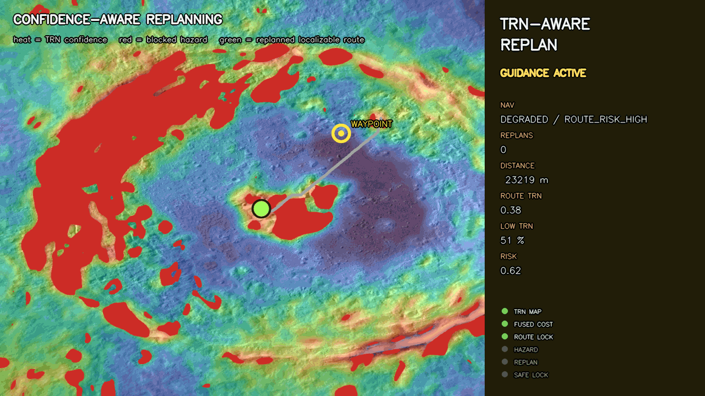

### Dynamic hazard replanning

The rover follows a hazard-aware route, detects a newly blocked segment, marks the route invalid, and
replans around the obstacle with the C++ `hazard_route_demo` planner.

- [MP4 video](figures/dynamic_hazard_replanning_demo.mp4)
- [GIF animation](figures/dynamic_hazard_replanning_demo.gif)
- [JSON summary](figures/dynamic_hazard_replanning_demo.json)

### Hazard-aware lunar navigation

The Tycho terminal TRN fixture is converted into an image-derived hazard cost map. The C++ planner
routes around high-cost terrain while the navigation state moves through lock, relocalization, and
arrival phases.

- [MP4 video](figures/hazard_aware_navigation_demo.mp4)
- [GIF animation](figures/hazard_aware_navigation_demo.gif)
- [JSON summary](figures/hazard_aware_navigation_demo.json)

### Lost Robot Challenge

A GNSS-denied lunar robot receives one synthetic star-camera frame and one lunar nadir frame, then
recovers attitude and position into a single mission-control card.

- [PNG card](figures/lost_robot_challenge.png)
- [JSON summary](figures/lost_robot_challenge.json)

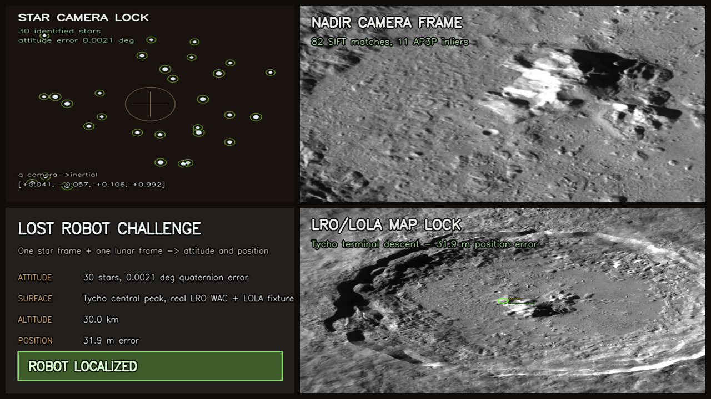

### Navigation replay

The navigation state machine starts lost, gains star-camera attitude, then reaches a full TRN position
lock over Tycho with a conservative sigma circle.

- [GIF animation](figures/navigation_replay_demo.gif)
- [JSON summary](figures/navigation_replay_demo.json)

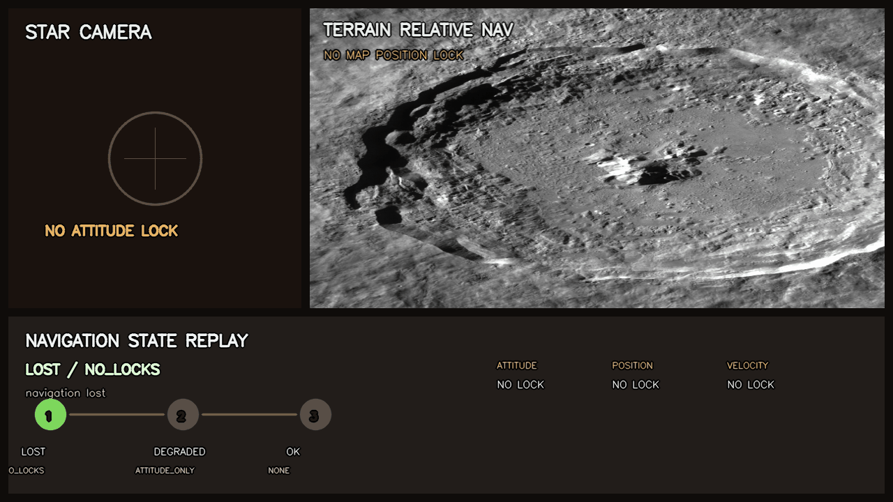

## TRN And Localizability

### Four-factor fusion (star + VO + Skyline + TRN)

All four localization modalities in one pose graph, chosen so the two absolute fixes have
complementary failure modes. Skyline reads the far horizon and aliases on Tycho's rotationally
symmetric rim; TRN matches a nadir LROC WAC patch against the orbital map and locks on that same
texture-rich rim (and would starve on smooth mare where the horizon still pins). Each absolute factor
is weighted by its own real uniqueness margin. Over Tycho the fused-plus-TRN estimate stays localized
across the whole traverse — RMSE 148 m vs 1090 m for skyline-only fusion (7.4×) and 3789 m for
VO-only (26×).

- [MP4 video](figures/skyline_lock/four_factor_fusion_demo.mp4)
- [GIF animation](figures/skyline_lock/four_factor_fusion_demo.gif)
- [Static figure](figures/skyline_lock/four_factor_fusion.png) · [JSON summary](figures/skyline_lock/four_factor_fusion.json)

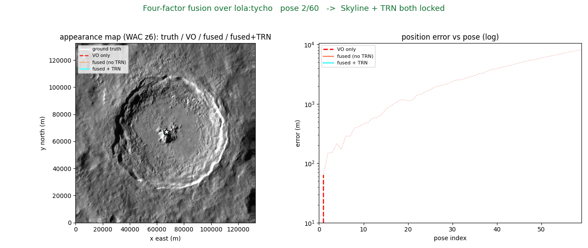

### Factor-graph fusion (star + VO + Skyline)

The project's localization modalities fused into one pose graph: a star-tracker attitude factor, a
drifting visual-odometry between-factor, and a Skyline position factor whose information is the real
uniqueness margin. Over Tycho the fused estimate hugs ground truth with a tight covariance ellipse
where the horizon locks uniquely (green) and coasts on VO with a growing ellipse where the fix aliases
(orange) and is down-weighted — ~4× lower RMSE than VO-only (958 m vs 3.8 km), degrading gracefully
rather than snapping to a wrong lock.

- [MP4 video](figures/skyline_lock/factor_graph_fusion_demo.mp4)
- [GIF animation](figures/skyline_lock/factor_graph_fusion_demo.gif)
- [Static figure](figures/skyline_lock/factor_graph_fusion.png) · [JSON summary](figures/skyline_lock/factor_graph_fusion.json)

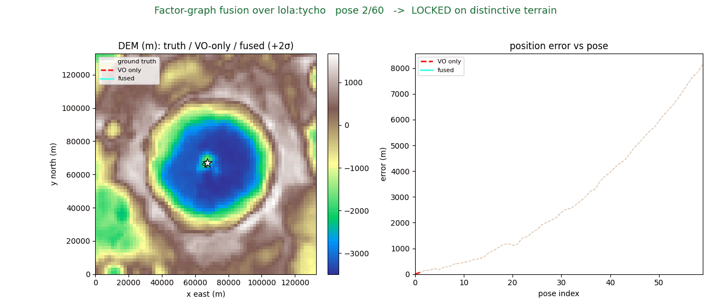

### Heading as a graph state (nonlinear SO(2) backend)

The fusion above fixes attitude to the star tracker. This demo promotes heading to a graph state and
solves a nonlinear SO(2) factor graph (self-contained Gauss-Newton, no GTSAM/Ceres). Across a
mid-traverse star-tracker blackout the resumed fixes flow backward through the VO yaw-increment chain
and recover heading from **5.4° → 0.3°** mean inside the gap (peak ~10° → 0.6°), snapping the
dead-reckoned arc onto truth (RMSE 148 m → 113 m). When the blackout ends the traverse — no future
anchor — the joint solve does no better than fixed-yaw (5.6° → 5.6°): the honest cliff. The animation
replays the Gauss-Newton iterations straightening the arc as the heading error collapses.

- [MP4 video](figures/skyline_lock/factor_graph_so2_demo.mp4)
- [GIF animation](figures/skyline_lock/factor_graph_so2_demo.gif)
- [Static figure](figures/skyline_lock/factor_graph_so2.png) · [JSON summary](figures/skyline_lock/factor_graph_so2.json)

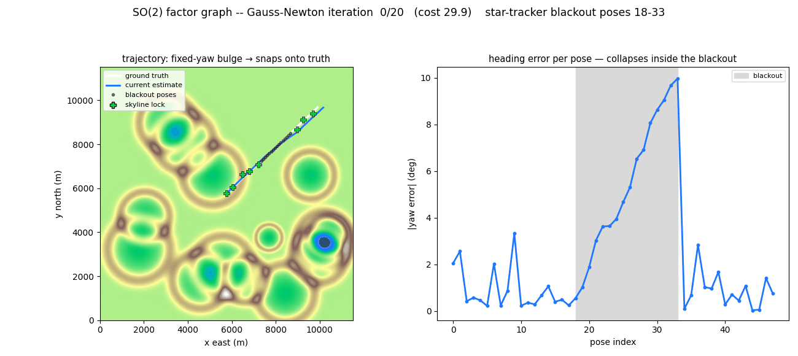

### Skyline Lock

A rover matches its observed horizon (elevation vs azimuth) against horizons predicted from real LOLA
terrain across a candidate-position grid, recovering position and heading. The Tycho traverse shows a
unique lock over the distinctive interior that degrades to an aliased arc as the rover leaves it —
localizability and its cliffs, made visible.

- [MP4 video](figures/skyline_lock/skyline_lock_demo.mp4)
- [GIF animation](figures/skyline_lock/skyline_lock_demo.gif)

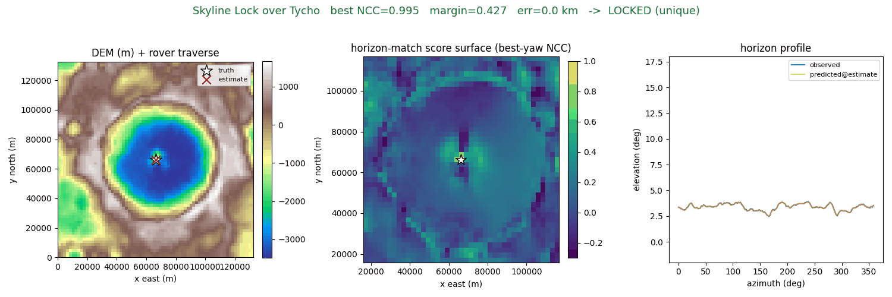

### Lunar curvature horizon model

The Moon's horizon is a spherical-datum cue: the surface drops ≈ r²/2R below the observer's tangent
plane, so from a 2 m mast the bare horizon is only 2.6 km away. The rover observes that true curved
horizon; this demo dials the *model* curvature from a flat plane to the true Moon. Over Tycho a near,
kilometre-high rim dominates and the fix holds the whole sweep (curvature is free); over Apollo 11
mare the flat model snaps the fix 16.6 km onto a phantom mode built from terrain below the lunar
horizon, and the curvature-correct model recovers the right cell. Same correction, opposite
consequence.

- [MP4 video](figures/skyline_lock/skyline_curvature_demo.mp4)
- [GIF animation](figures/skyline_lock/skyline_curvature_demo.gif)
- [Static figure](figures/skyline_lock/skyline_curvature.png) · [JSON summary](figures/skyline_lock/skyline_curvature.json)

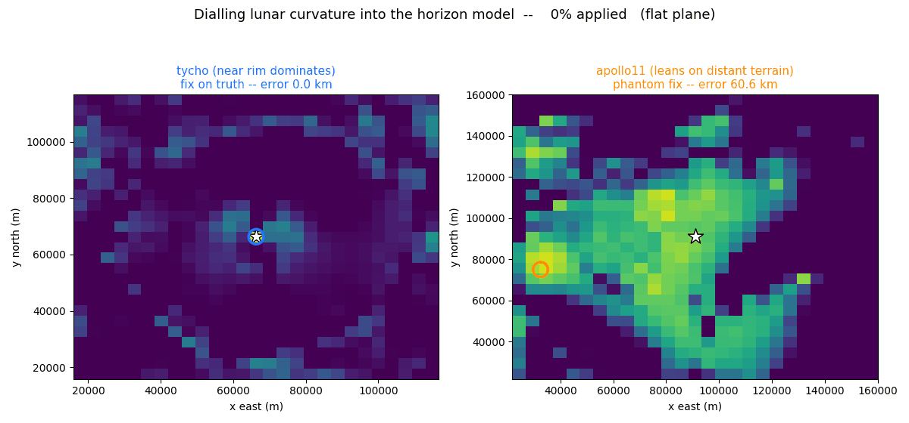

### Skyline localizability routing

The per-position horizon uniqueness becomes a localizability map (bright where a rover can pin itself
from the horizon, dark over self-similar / rotationally symmetric terrain). A localizability-aware A*
detours onto the distinctive rim instead of crossing aliased terrain — a horizon-driven "don't get
lost" route.

- [PNG comparison](figures/skyline_lock/skyline_localizability_route.png)
- [JSON summary](figures/skyline_lock/skyline_localizability_route.json)

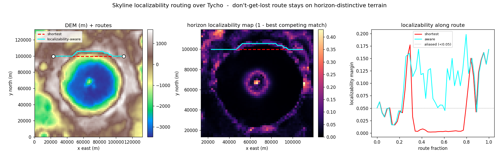

### TRN confidence heatmap

A localizability map over the Tycho ortho fixture. It scores where terrain-relative navigation should
have stronger lock potential from gradient energy, local texture, feature density, and illumination.

- [PNG heatmap](figures/trn_confidence_heatmap.png)
- [JSON summary](figures/trn_confidence_heatmap.json)

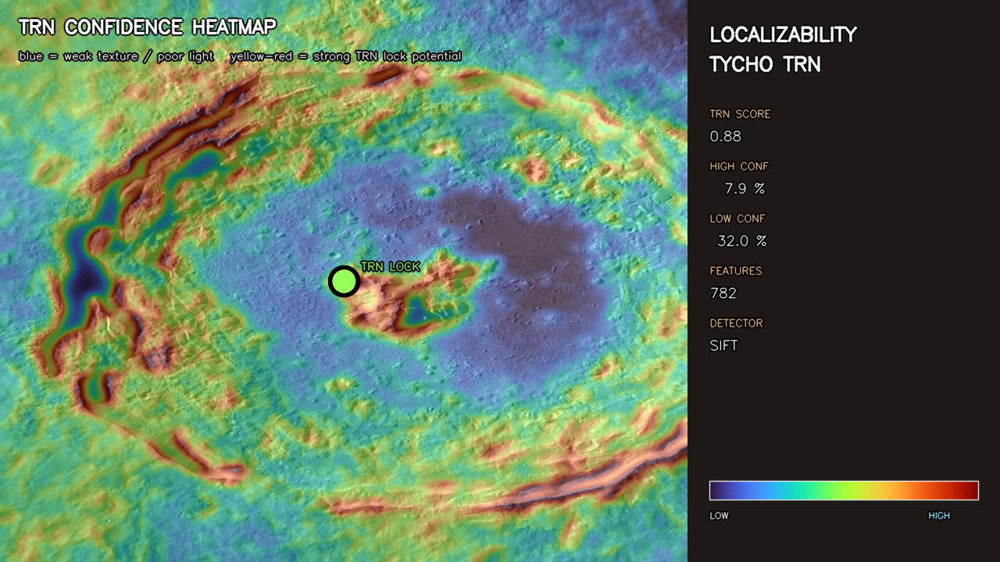

### Localizability-aware routing

Compares a hazard-only route with a route that keeps the same blocked terrain while adding cost for
weak TRN localizability.

- [PNG comparison](figures/localizability_aware_route.png)
- [JSON summary](figures/localizability_aware_route.json)

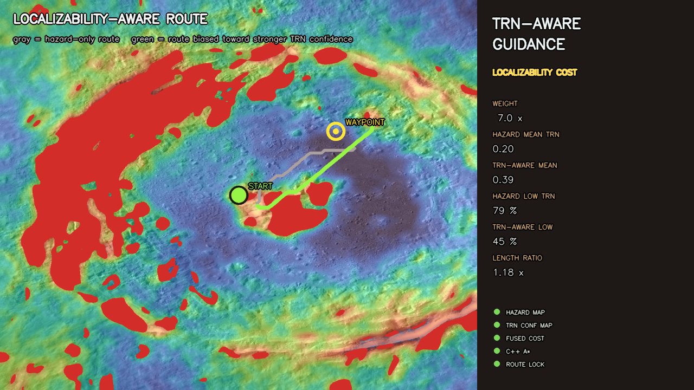

### TRN trajectory

Frame-by-frame position recovery on a Tycho descent trajectory. Each frame solves PnP from a nadir
image against the LRO ortho without an inertial prior or temporal filter.

- [GIF animation](figures/trn_trajectory_demo.gif)

### Lunar landing mission

Star tracker attitude and TRN position recovery shown together across six descent moments from
orbital insertion to touchdown burn.

- [GIF animation](figures/mission_demo.gif)

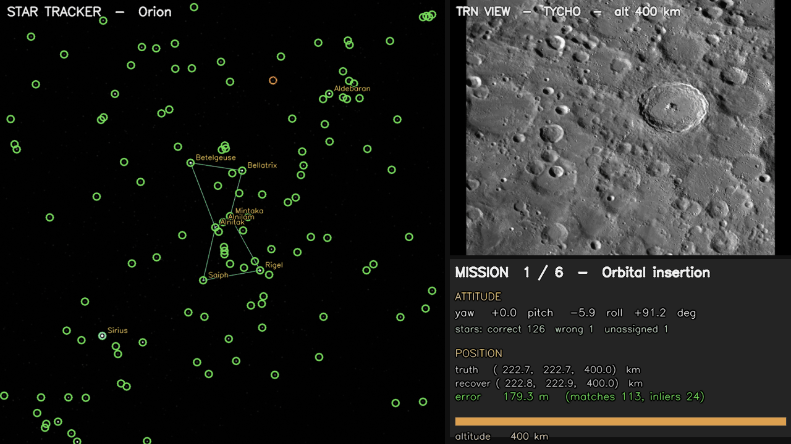

## Star Tracker And VO

### Lost-in-space identification

Synthetic attitudes across recognizable constellations, with recovered star IDs, constellation lines,
and labels.

- [GIF animation](figures/lost_in_space_demo.gif)
- [PNG still](figures/lost_in_space_demo.png)

### POLAR visual odometry

NASA POLAR traverse imagery rendered with SIFT features and a visual-odometry trajectory overlay.

- [GIF animation](figures/polar_traverse1_vo_demo.gif)
- [PNG still](figures/polar_traverse1_vo_demo.png)
- [Feature snapshot](figures/polar_traverse1_features.png)
- [Sample frame](figures/polar_traverse1_sample.png)

